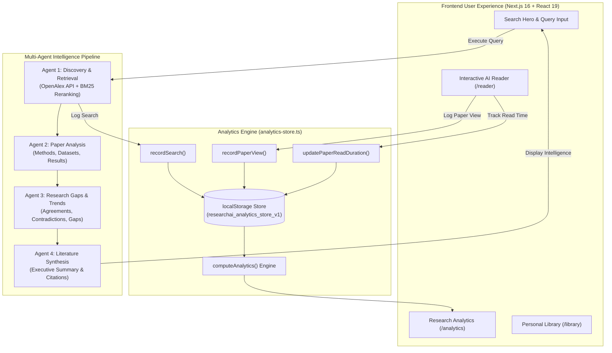

<div align="center">

  

  # ResearchAI

  **Next-Generation Autonomous Academic Discovery & Research Intelligence Platform**

  *From Questions to Discoveries — Accelerated by Multi-Agent AI*

  <p align="center">
    <a href="#overview">Overview</a> •
    <a href="#key-features">Key Features</a> •
    <a href="#architecture">Architecture</a> •
    <a href="#research-analytics">Analytics</a> •
    <a href="#tech-stack">Tech Stack</a> •
    <a href="#getting-started">Getting Started</a> •
    <a href="#project-structure">Project Structure</a>
  </p>

  [](https://nextjs.org/)
  [](https://react.dev/)
  [](https://www.typescriptlang.org/)
  [](https://tailwindcss.com/)
  [](https://orm.drizzle.team/)
  [](https://openalex.org/)

</div>

---

## 🔬 Overview

**ResearchAI** is an AI-powered academic research engine designed for scholars, scientists, students, and engineers. It indexes over **250M+ research papers** across global academic repositories (OpenAlex, arXiv, PubMed, Nature, IEEE), performs autonomous multi-paper synthesis, uncovers unexplored research gaps, and powers an interactive AI document reader.

With built-in **Research Analytics**, ResearchAI tracks literature queries, paper readings, topic depth, and estimated research hours saved — turning academic workflows into measurable discoveries.

---

## ✨ Key Features

### 1. 🔍 Autonomous Research Discovery
- **Deep Academic Search**: Direct integration with OpenAlex indexing millions of journals, conferences, and preprints.
- **BM25 Relevance Reranking**: Combines semantic embeddings with BM25 ranking algorithms for precise citation-aware matching.
- **Dynamic Filters & Sorting**: Filter by publication year, citation velocity, open-access status, and scientific domains.

### 2. 🧠 Multi-Agent Research Intelligence
- **Agent 1 (Discovery & Retrieval)**: Formulates targeted sub-queries, queries academic APIs, and retrieves full-text corpora.
- **Agent 2 (Paper Analysis)**: Extracts problem statements, methodology, models, datasets, metrics, and empirical findings.
- **Agent 3 (Gap & Trend Explorer)**: Identifies cross-paper consensus, conflicting findings, methodological trends, and actionable research gaps.
- **Agent 4 (Literature Synthesis)**: Synthesizes executive summaries, comprehensive literature reviews, and citation-backed claims.

### 3. 📖 Interactive AI Reader & Copilot (`/reader`)
- **Structured Reader & PDF Mode**: Toggle between parsed section-by-section reading and raw PDF views.
- **Multi-Color Highlighting**: Annotate text in 4 colors (Yellow, Blue, Green, Purple) with persistent notes.
- **Context-Aware AI Copilot**: Ask questions about equations, statistical methodology, or experimental setups with real-time streaming answers.
- **Visibility-Aware Reading Tracker**: Logs active reading sessions and updates time velocity metrics.

### 4. 📊 Live Research Analytics (`/analytics`)
- **Real-Time Event Tracking**: Captures search queries, paper reading sessions, and library saves in an event-driven store.
- **Four Core KPI Stat Cards**:
  - **Research Projects**: Active research inquiries and organized collections.
  - **Topics Explored**: Distinct academic concepts extracted across searches and readings.
  - **Research Queries**: Total literature search inquiries conducted.
  - **Hours Saved**: Calculated via academic acceleration metrics ($1.5\text{h}$ saved per search + $2.0\text{h}$ per paper read + $0.5\text{h}$ per library save).
- **Interactive Research Activity Bar Chart**: Dual-colored bars (Searches vs. Views) with day-by-day hover tooltips and time range filtering (*Last 7 days*, *Last 30 days*, *Last 90 days*, *All time*).
- **Top Research Topics**: Ranked concepts with frequency progress bars and 1-click search execution.
- **Papers by Source**: Segmented distribution across OpenAlex, arXiv, PubMed, Nature, IEEE, and Crossref.
- **Multidisciplinary Research Areas**: Automated classification into AI & Computer Science, Medicine & Healthcare, Environmental & Agriculture, Physics, and Life Sciences.
- **Quality Insights & Milestones**: Average citations per paper, Open Access availability rate, and achievement badges.

### 5. 📚 Personal Library & Organization (`/library`)
- Bookmark and categorize papers with reading statuses: `unread`, `read`, `has_notes`.
- Search and filter personal saved items by topic or venue.
- Export citations and persistent highlights across sessions.

---

## 🏗️ Architecture



---

## 📈 Research Analytics Equations

ResearchAI uses rigorous academic acceleration modeling to calculate productivity impact:

| Metric | Calculation Formula | Description |
| :--- | :--- | :--- |
| **Hours Saved** | $\mathrm{round}(1.5 \times Q + 2.0 \times V + 0.5 \times S)$ | $Q$ = Queries, $V$ = Papers Read, $S$ = Saved Papers |
| **Period Growth** | $\mathrm{round}\left(\frac{\text{Current} - \text{Previous}}{\text{Previous}}\right) \times 100\%$ | Comparative delta against the equivalent prior period |
| **Open Access Rate** | $\mathrm{round}\left(\frac{\text{Open Access Views}}{\text{Total Views}}\right) \times 100\%$ | Ratio of publicly accessible open literature reviewed |
| **Avg Citations** | $\mathrm{round}\left(\frac{\sum \text{Citations}}{\text{Total Papers Reviewed}}\right)$ | Mean citation index across all explored literature |

---

## 💻 Tech Stack

| Layer | Technology | Description |
| :--- | :--- | :--- |
| **Framework** | [Next.js 16 (Turbopack)](https://nextjs.org/) | React Server Components & App Router |
| **UI Library** | [React 19](https://react.dev/) | Core UI rendering engine |
| **Language** | [TypeScript 5](https://www.typescriptlang.org/) | Full end-to-end type safety |
| **Styling** | [Tailwind CSS 3.4](https://tailwindcss.com/) | Modern responsive design system |
| **Animations** | [Motion (Framer Motion 12)](https://motion.dev/) | Smooth transitions, gestures, and bar charts |
| **Icons** | [Lucide React](https://lucide.dev/) | Clean, consistent vector iconography |
| **AI SDK** | [Vercel AI SDK](https://sdk.vercel.ai/) | LLM orchestration and streaming copilot |
| **Academic API** | [OpenAlex API](https://openalex.org/) | Academic paper discovery and metadata |
| **Database & ORM**| [Drizzle ORM](https://orm.drizzle.team/) + [Neon PostgreSQL](https://neon.tech/) | Serverless database storage |
| **Auth** | [Better-Auth](https://better-auth.com/) | Authentication and session management |

---

## 🚀 Getting Started

### Prerequisites
- **Node.js**: v18.18 or higher (v20+ recommended)
- **npm**, **yarn**, or **pnpm**

### Installation

1. **Clone the repository:**
   ```bash
   git clone https://github.com/wadekarharshvardhan/researchAI.git
   cd researchAI
   ```

2. **Install dependencies:**
   ```bash
   npm install
   ```

3. **Set up Environment Variables:**
   Create a `.env.local` file in the root directory:
   ```env
   # OpenAI API Key (Required for AI Copilot and Agent Synthesis)
   OPENAI_API_KEY=your_openai_api_key_here

   # Database URL (Optional: For Neon PostgreSQL persistence)
   DATABASE_URL=your_postgres_connection_string_here
   ```
   > *Note: Academic paper searches via OpenAlex work out-of-the-box without requiring an API key.*

4. **Run the Development Server:**
   ```bash
   npm run dev
   ```

5. **Open in Browser:**
   Visit [http://localhost:3000](http://localhost:3000) to start researching.

---

## 📁 Project Structure

```
researchAI/
├── public/
│   ├── images/
│   │   ├── logoblue.png          # Primary ResearchAI blue logo
│   │   ├── logowhite.png         # Dark-mode / inverted white logo
│   │   └── hero-bg.webp          # High-resolution landscape background
│   ├── logo.png                  # Main favicon and branding
├── src/
│   ├── app/                      # Next.js App Router routes
│   │   ├── analytics/page.tsx    # Analytics dashboard route
│   │   ├── reader/page.tsx       # Interactive AI Reader & Copilot
│   │   ├── api/                  # API routes (OpenAlex, Copilot, Orchestration)
│   │   └── page.tsx              # Home search landing page
│   ├── components/
│   │   ├── dashboard/            # Dashboard modules
│   │   │   ├── AnalyticsPage.tsx # Analytics KPI cards, charts & insights
│   │   │   ├── AnalyticsRightbar.tsx # Dynamic analytics highlights & activity feed
│   │   │   ├── Dashboard.tsx     # Main dashboard controller
│   │   │   ├── ExplorePage.tsx   # Curated domain & topic discovery
│   │   │   ├── LibraryPage.tsx   # Saved papers & notes manager
│   │   │   ├── PaperCard.tsx     # Rich paper card with PDF thumbnail & actions
│   │   │   └── ResearchPage.tsx  # Multi-paper intelligence results & views
│   │   ├── reader/               # AI Reader components
│   │   │   ├── AICopilotPanel.tsx# Context-aware chat copilot
│   │   │   ├── DocumentViewer.tsx# Section-based structured reader
│   │   │   └── ReaderToolbar.tsx # Color picker & mode switcher
│   │   └── navbar/               # Global navigation bars
│   ├── lib/
│   │   ├── analytics-store.ts    # Central analytics tracking & calculation engine
│   │   ├── library-papers.ts     # Saved paper storage and status handlers
│   │   ├── paper-reader-store.ts # Highlights and active reader session store
│   │   └── recent-searches.ts    # Recent search queries store
│   ├── tools/
│   │   └── openalex.ts           # OpenAlex API search client & mapper
│   └── types/
│       └── research-paper.ts     # TypeScript interfaces for papers, reports, and gaps
├── drizzle.config.ts             # Drizzle ORM configuration
└── package.json                  # Dependencies and scripts
```

---

## 🧪 Testing & Validation

Run the TypeScript type checker:
```bash
npx tsc --noEmit
```

Build for production:
```bash
npm run build
```

---

## 🤝 Contributing

Contributions, feedback, and feature suggestions are welcome!
1. Fork the repository
2. Create a feature branch (`git checkout -b feature/amazing-feature`)
3. Commit your changes (`git commit -m "Add amazing feature"`)
4. Push to the branch (`git push origin feature/amazing-feature`)
5. Open a Pull Request

---

## 📄 License

This project is licensed under the MIT License — see the [LICENSE](LICENSE) file for details.

<div align="center">
  <sub>Built with ❤️ for researchers, academics, and thinkers worldwide.</sub>
</div>
